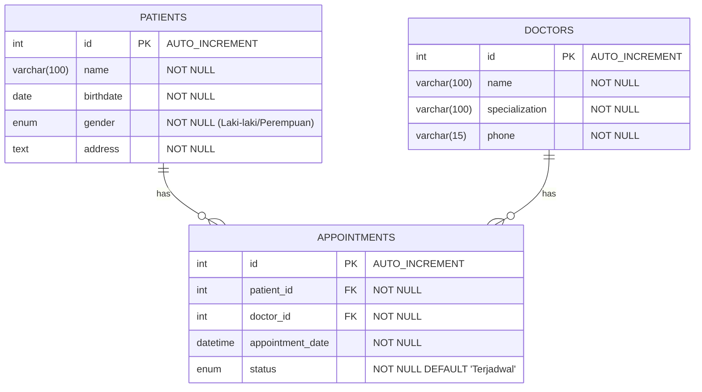

# Desain dan Pemrograman Berbasis Objek

---

## Tugas Praktikum 7

---

### Janji

---

Saya Fariz Wibisono dengan NIM 2307589 mengerjakan Tugas Praktikum 7 dalam mata kuliah Desain dan Pemrograman Berorientasi Objek untuk keberkahanNya maka saya tidak melakukan kecurangan seperti yang telah dispesifikasikan. Aamiin.

### Dokumentasi

---

Berikut adalah dokumentasi berupa rekaman hasil implementasi program:

<div align="center">
   <video src="https://github.com/user-attachments/assets/bb1edbc5-1f47-45d8-966b-5faac161acb8" controls style="width: 100%;"></video>
</div>

### Diagram Kelas

---

Berikut adalah diagram Entity Relationship untuk sistem manajemen klinik:



Keterangan:
- Satu pasien dapat memiliki banyak janji temu (one-to-many)
- Satu dokter dapat memiliki banyak janji temu (one-to-many)
- Setiap janji temu terhubung dengan tepat satu pasien dan satu dokter

### Penjelasan Alur Program

---

Program ini merupakan Sistem Manajemen Klinik berbasis web menggunakan PHP dengan paradigma Object-Oriented Programming (OOP). Aplikasi ini dirancang untuk membantu pengelolaan data pasien, dokter, dan janji temu di klinik. Berikut penjelasan detail alur program:

1. **Dashboard Utama (index.php)**:
   - Menampilkan ringkasan jumlah pasien, dokter, dan janji temu
   - Menyediakan akses cepat ke modul-modul utama sistem

2. **Alur Manajemen Pasien**:
   - Pengguna dapat melihat daftar semua pasien dalam bentuk tabel
   - Form penambahan pasien baru dengan validasi data
   - Detail pasien dapat dilihat dengan mengklik tombol "View"
   - Data pasien dapat diubah melalui form edit
   - Penghapusan data pasien dengan konfirmasi

3. **Alur Manajemen Dokter**:
   - Pengguna dapat melihat daftar dokter beserta spesialisasinya
   - Form registrasi dokter baru dengan validasi input
   - Detail dokter dapat diakses melalui halaman detail
   - Pembaruan informasi dokter melalui form edit
   - Penghapusan data dokter dengan dialog konfirmasi

4. **Alur Manajemen Janji Temu**:
   - Pencatatan janji temu baru dengan memilih pasien, dokter, dan tanggal
   - Daftar semua janji temu ditampilkan dengan status (Pending, Confirmed, Canceled)
   - Detail janji temu dapat dilihat untuk informasi lebih lanjut
   - Status janji temu dapat diubah sesuai kebutuhan
   - Penghapusan janji temu dengan konfirmasi

### Desain Sistem

---

Sistem ini dirancang dengan arsitektur MVC (Model-View-Controller) sederhana untuk memudahkan pemeliharaan dan pengembangan:

#### Model (class/)
- **Patient.php**: Kelas untuk operasi CRUD data pasien
  - Atribut: id, name, birthdate, gender, address
  - Metode: create(), read(), update(), delete(), readAll()

- **Doctor.php**: Kelas untuk operasi CRUD data dokter
  - Atribut: id, name, specialization, phone
  - Metode: create(), read(), update(), delete(), readAll()

- **Appointment.php**: Kelas untuk operasi CRUD data janji temu
  - Atribut: id, patient_id, doctor_id, appointment_date, status
  - Metode: create(), read(), update(), delete(), readAll(), searchByPatientName()

#### View (view/)
- **layouts/**: Template header dan footer untuk konsistensi UI
- **patients/**: Halaman untuk manajemen data pasien
- **doctors/**: Halaman untuk manajemen data dokter
- **appointments/**: Halaman untuk manajemen janji temu

#### Controller (file utama)
- **index.php**: Halaman dashboard utama
- **patients.php**: Controller untuk manajemen pasien
- **doctors.php**: Controller untuk manajemen dokter
- **appointments.php**: Controller untuk manajemen janji temu

#### Konfigurasi dan Database
- **config/database.php**: Implementasi koneksi database dengan PDO
- **database/db_clinic.sql**: Struktur database dan data awal

### Implementasi Konsep OOP

---

Sistem manajemen klinik ini menerapkan konsep-konsep OOP sebagai berikut:

1. **Encapsulation**: 
   - Atribut pada kelas model bersifat private
   - Pengaksesan dan manipulasi data melalui metode khusus

2. **Inheritance**:
   - Kelas Database digunakan sebagai parent class
   - Model-model entitas mewarisi fungsionalitas koneksi database

3. **Polymorphism**:
   - Implementasi metode CRUD yang berbeda untuk setiap model
   - Override metode sesuai dengan kebutuhan spesifik tiap entitas

4. **Abstraction**:
   - Interface yang konsisten untuk operasi CRUD
   - Detail implementasi disembunyikan dari pengguna sistem

### Implementasi PDO dan Prepared Statements

---

Sistem ini menggunakan PDO (PHP Data Objects) dan prepared statements untuk semua interaksi dengan database untuk meningkatkan keamanan dan performa:

1. **Konfigurasi PDO** (`config/database.php`):
   ```php
   // Membuat koneksi PDO
   $this->conn = new PDO(
       "mysql:host=" . $this->host . ";dbname=" . $this->db_name,
       $this->username,
       $this->password
   );
   // Mengatur mode error PDO
   $this->conn->setAttribute(PDO::ATTR_ERRMODE, PDO::ERRMODE_EXCEPTION);
   ```

2. **Implementasi Prepared Statements di Model**:
   - Contoh Create Operation:
     ```php
     $query = "INSERT INTO patients (name, birthdate, gender, address) VALUES (?, ?, ?, ?)";
     $stmt = $this->conn->prepare($query);
     $stmt->bindParam(1, $this->name);
     $stmt->bindParam(2, $this->birthdate);
     $stmt->bindParam(3, $this->gender);
     $stmt->bindParam(4, $this->address);
     $stmt->execute();
     ```

3. **Keamanan Input**:
   - Semua input pengguna disanitasi sebelum diproses:
     ```php
     $this->name = htmlspecialchars(strip_tags($this->name));
     ```
   - Semua input pengguna di-bind ke prepared statements untuk mencegah SQL injection

### Instalasi dan Penggunaan

---

1. **Prasyarat**:
   - XAMPP (versi 7.4 atau lebih baru)
   - Browser web modern

2. **Langkah Instalasi**:
   - Salin seluruh folder proyek ke direktori `htdocs` XAMPP
   - Buat database `db_clinic` di phpMyAdmin
   - Import file `database/db_clinic.sql`
   - Sesuaikan konfigurasi database di `config/database.php` jika diperlukan
   - Akses aplikasi di `http://localhost/clinic-management-system`